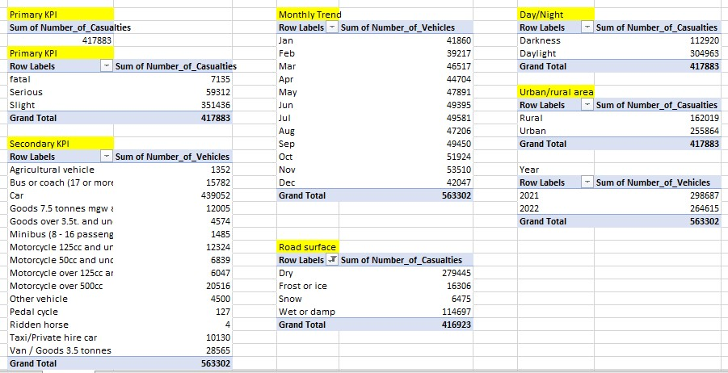
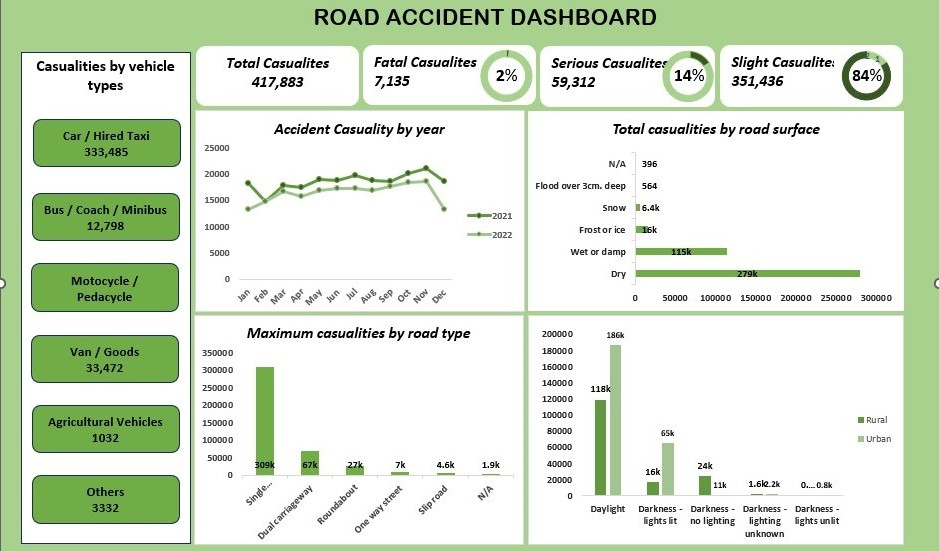

# Road-Accident-data-Analysis
## INTRODUCTION
Road Accident data is a dataset which holds information concerning accident occurrence in the cities of kensington and chelsea from 2021 to 2022.
Disclaimer: This dataset and report do not represent any company, institution or country but just a dummy dataset to show my capabilities in using excel for data analysis

## OBJECTIVES:
The client needs me to create a road accident dashboard for the years 2021 and 2022 so that they can have insight on following 
1.	Primary KPI – Total casualties taken place after the accident
2.	Primary KPI’s - Total casualties & percentage of total with respect to accident severity and maximum casualties by type of vehicles
3.	Secondary KPI’s - Total casualties with respect to vehicle type
4.	Monthly trend showing comparison of casualties for current year and previous year casualties by road type 
5.	Distribution of total casualties by road surface
6.	Relation between casualties by area/location & by day/Night

## SKILLS DEMONSTRATED
•	Data Cleaning, Data Transformation, Data Analysis
•	Filtering, Sorting and Conditional function.
•	Pivot Tables and Pivot Chart
•	Data Visualization and Dashboard creation

## ANALYSIS TOOL AND DATA SOURCE
This project was carried out using MICROSOFT EXCEL for both the data analysis and dashboard creation while the data was sourced from a data analysis bootcamp I participated in.

## Data cleaning and transformation 
Although the dataset was quite clean, i carried out some transformations as outlined below
1.	Checking NULL values, blanks and Errors
2.	Removing duplicates, and irrelevant columns.
3.	Creating 2 new attributes 'Year' and 'Month' were added for logical and easy interpretation of dataset.
4.	Made sure data information is consistent to aid interpretation like streamlining the different variations of light conditions column into just darkness and light.

   
## ANALYSIS PROCESS
Pivot table charts were created to help identify trends in the dataset while focusing on the relationship between number of casualties against some of the factors such as - casualty type, vehicle type, road type e.t.c. This chart was eventually summarized into an "Analysis" sheet as shown below

## VISUALIZATION 
Finally, a dashboard was built by inserting the pivot charts of which captured the project objectives as requested by the client. Below is a snippet of the Analysis dashboard

## RECOMMENDATIONS CONCLUSION
From the analysis carried out it can be concluded 
1.	The critical periods for accident occurrences are the months of October and November in both years under review. The road safety measure by stakeholders must be active and focused during these high-risk periods.
2.	The bulk of causalities are the car drivers so they should be top of the list for awareness camps and strict monitoring.
3.	Urban areas should be targeted for interventions to improve road safety especially during daytime as the bulk of causalities occur in these areas and time of the day.

